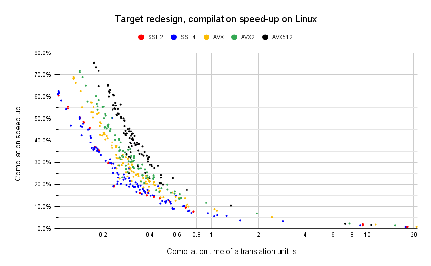

# Target Redesign Design Document

## Standard and Builtin Library Structure

The ISPC compiler contains a standard library. It includes a handful of useful functions that users can use when writing their own code in ISPC language. The standard library is written in ISPC language in the file `stdlib.ispc`. Its implementation relies on target-specific functions implemented in LLVM-IR and placed under the `builtin` folder; they form a `builtin` library.

By design, the standard library has to be provided automatically for every compiled ISPC program unless the opposite is said by the `--nostdlib` command-line flag. This automatic inclusion ensures that essential functions &mdash; ranging from mathematical operations, print capabilities for output, memory management, to data conversion &mdash; are readily available to the developer.

The built-in library is composed of three distinct parts:

1. Dispatcher: This component directs calls to the appropriate implementation based on the actual ISA.
2. Target Independent: This includes functions that are universal across all target ISAs, such as print.
3. Target Dependent: This part contains functions optimized for specific target ISA, like `avx2` or `avx512`.

## Build of Standard and Builtin Libraries

The standard and built-in libraries are to be distributed with ISPC, which automatically provides them based on the target ISA and OS if needed. This design proposes to distribute them alongside the compiler as LLVM bitcode files. This approach requires the build system to prepare the libraries during the ISPC build phase. The process is as follows:

1. Dispatching and Target-Dependent Parts: These are written on templated LLVM IR and instantiated by `m4` to produce target-dependent code for every target ISA for any supported width (by current build configuration). Then, `llvm-as` generates corresponding bitcode files.
2. Target-Independent Part: This is written in C/C++ and compiled by `clang` into bitcode format for every supported OS by the current build configuration.
3. Standard Library: This is written in ISPC language and compiled into LLVM bitcode format by the ISPC compiler, which must be pre-built.

## Introduction of Headers for Standard and Builtin Libraries

ISPC compiles programs that can invoke functions from its standard library. A significant enhancement in this redesign is the introduction of the following header files:

1. `core.isph` introduces explicit definitions for essential symbols &mdash; such as `programIndex`, `programCount`, `PI`, `_have.*`, `_pseudo*` and etc.
2. `stdlib.isph` outlines the definitions for the standard library's functionalities.

The `core.isph` header is included implicitly for every translation unit, whereas `stdlib.isph` is included if needed only. Both these headers expose user-visible definitions. There are also a few headers: `builtins.isph`, `target.isph` and `svml.isph`. They define the API of the built-in library, i.e., supporting a new target in the built-in library is a matter of implementing all functions of this API.

This change also opens the door to implementing certain standard library functionalities directly within the header file using templates, e.g., short vector arithmetic. Moreover, this change could allow for the migration of various other target-independent functions from built-in LLVM files to the ISPC standard library code, enhancing clarity and simplification. At the moment, the number of lines written in LLVM IR has been reduced by 8%.

## Distribution of Standard and Builtin Libraries

All associated bitcode files from the standard and built-in libraries and the `stdlib.isph` header file must be distributed with the ISPC compiler binary. There are two approaches:

1. ***Slim Binary*** &mdash; distribute them alongside the ISPC binary within a designated directory structure.
2. ***Composite Binary*** &mdash; embed them into the ISPC binary itself.

The first approach, unlike the second, introduces extra files and directories. These are essential for the ISPC compiler to locate the bitcode files and header files accurately. Consequently, when distributing or relocating the ISPC binary, it's crucial to maintain the relative positions of these resources to ensure the compiler's functionality.

The second approach is similar to the current method, where target-dependent bitcode files are embedded directly into the ISPC binary. This approach has a significant advantage &mdash; it does not disrupt the current distribution practices. This means ISPC users can seamlessly continue downloading and installing ISPC with their existing workflows and scripts, without any need for modifications.

It's important to note that these approaches are not mutually exclusive. Some users, particularly those in the open-source community who maintain ISPC packages for different Linux OSes, may prefer the first approach. This flexibility allows for different distribution methods to coexist, catering to the diverse needs of the ISPC user community.

## ISPC Build Process

The build process for ISPC includes the following steps:

1. Generate all built-in library bitcode files.
2. Compile the slim ISPC binary.
3. Generate standard library bitcode files using the slim binary.
4. Embed all bitcode files and header files into the binary, producing the composite ISPC binary.

The build and installation process is configurable to support both the slim and composite binary scenarios. By default, ISPC is configured to build as the composite binary. There is a CMake option to configure ISPC as the slim binary `-DISPC_SLIM_BINARY=ON`. Under this configuration, the step 4 is turned off.

## User Code Compilation

The compilation process of an ISPC program is structured into the following steps:

1. Include header files: `core.isph` and `stdlib.isph` (if needed).
2. Translate the ISPC source code into LLVM IR, which includes:
   1. Preprocess the ISPC source,
   2. Parse the ISPC source to create an internal AST representation,
   3. Generate LLVM IR from the AST.
3. Link the standard library.
4. Link the built-in library
5. Execute the optimization pipeline.
6. Generate the target code (codegen).

Steps 1 through 4 progressively populate the LLVM module with the necessary code. Step 1 provides definitions of standard library functions. Step 3 ensures that symbols from the standard library utilized in the ISPC source file are resolved. Step 4 ensures that symbols from the built-in libraries used in the standard library functions are resolved. In multi-target compilation scenarios, all built-in and standard library functions are appended with an ISA-specific suffix.

Before Step 5, it's essential to refine the LLVM module to exclude unused functions and symbols. This is accomplished by linking only the required symbols into the resulting module and performing global dead code elimination. An exception is made for a subset of functions primarily related to memory access (e.g., `gather`/`scatter` operations), which must be retained throughout the optimization pipeline due to potential late-stage optimization uses (e.g., in `ImproveMemoryOps.cpp`). These are preserved through references in the `llvm.compiler.used` symbol and removed in the final optimization step by the `RemovePersistentFuncs` pass.

## Hierarchical Implementation of Builtin Functions

Ideally, built-in functions should have target-independent implementation. It can be handy for initial support of new targets, e.g., RISC-V or others. Implementing these target-independent built-in functions could be achieved through LLVM IR, avoiding target-specific constructs (like certain intrinsic functions), or through ISPC itself, although its feasibility in the current state is uncertain. This common baseline has to be good enough as the starting point for incrementally implementing target-specific and performance-critical pieces. Taking the X86 ISA as an example, the development path of builtin functions could follow a progression from a common implementation to more specialized ones: `common` -> `sse2` -> `sse4` -> `avx` -> `avx2` -> `avx512`.

The compilation process for ISPC programs, as outlined, necessitates adjustments to accommodate a hierarchical implementation of target built-in functions. This adjustment, particularly impacting Step 4, will require additional effort. To integrate built-in code effectively, the process should initiate with the most specialized ISA compatible with the user's request. Should this ISA resolve all symbols, the process can advance further. If unresolved symbols remain, the process must ascend to a more general ISA, continuing to resolve symbols iteratively until all are addressed by a common implementation.

It's important to highlight that ISPC currently employs a similar strategy, utilizing manually written m4-based macro templates. However, this method necessitates that developers fully define all target-specific built-in libraries, which can be time-consuming and prone to errors. This issue is likely pronounced for fragmented, feature-based ISAs like RISC-V.

## Performance

Due to changes in the user code compilation process, the performance of ISPC increases. This happens due to two factors:

1. no time spent to parse and generate LLVM IR for `stdlib.ispc`
2. less code goes to the optimization pipeline

The following table highlights ISPC performance measured on the corpus of translation units gathered from open-source projects (Intel® Open Image Denoise, Intel® Open VKL, Intel® OSPRay).

**ISPC speed-up with target redesign**

| OS | Min, % | Max, % | Overall, % | Median, % | Avg, % |
|:----------|----------:|----------:|----------:|----------:|----------:|
| Linux | 0.7 | 75.6 | 13.6 | 31.3 | 33.1 |
| Windows (slim) | 3.4 | 69.6 | 16.8 | | |
| Windows (composite) | -5.5 | 39.1 | 3.7 | | |

Unexpectedly, on the Windows platform, the performance of the ISPC binary depends on whether resource files (headers, bitcode for built-in and standard libraries) are embedded into the binary. For the composite binary, there are two opposing trends in performance: positive and negative. The positive one includes the two factors mentioned above, while the negative aspect is the increase in binary size. As a result, ISPC compiles some translation units faster (up to 39.1%) but others slower (up to 5.5%). Performance measurements comparing composite vs. slim binaries support this. On the Windows platform, the slim binary is 4-72% faster, and overall corpus time is reduced by 16.8%.

From the developer's point of view, the most visible is that `make check-all` works 3x times faster.

